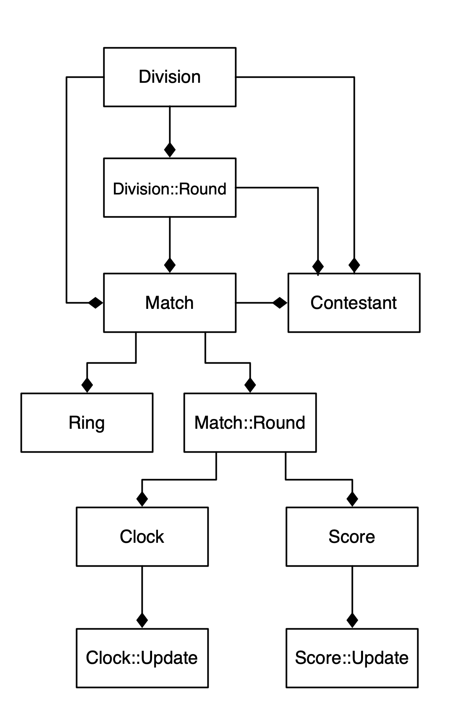

# PSF DBO

Classes in Pilsung Fighter are managed with a DBO and SQLite3 database.

## Instantiating New or Retrieving Existing Objects

### Autovivification

Instantiating a new object automatically creates the record in the database, except when the instance is given a UUID, in which case the database record is retrieved and the object is instantiated from that record.

**Example**

    my $contestant = new PSF::Contestant(); # Creates a new record
    my $uuid       = $contestant->uuid();
    
    $contestant = new PSF::Contestant( $uuid ); # Retrieves the record

### Populating with values

New objects can be provided values as key-value pairs.

**Example**

    my $contestant = new PSF::Contestant( 
        name   => 'Jennifer Chu', 
        gender => 'f',
        age    => 12,
        weight => 38.4,
        rank   => 'black 1st dan'
    );

### Searching

Objects can be retrieved from the database using `first()` and `search()`, returning one or more entries respectively.

Searching can include direct string comparison, inclusive min-max ranges, and lists of acceptable values.

**Examples**

    my $contestant = PSF::Contestant->first( where => { name => 'Jennifer Chu' });

    my @contestants = PSF::Contestant->search( where => { 
        gender => 'f', 
        age    => [ 12, 14 ], 
        weight => [ 37.1, 41 ], 
        rank   => [ 'black 1st dan', 'black 2nd dan', 'black 3rd dan', 'black 4th dan' ]
    });

## Working with Objects

## Setting/Retrieving Values

Setting a value can be done by calling the field (using snake case) as a method and supplying the value to be set.

Getting a value can be done by calling the field without any values. If the field is pluralized, then the method shall return an array of values. 

    my $contestant->name( 'Alejandra Ramirez Beltran' );

    my @contestants = $division->contestants();
    push @contestants, $contestant;
    $division->contestants( \@contestants );
    foreach my $contestant (@contestants) { ... }

## Object Relationships

    my $chung = PSF::Contestant->first( where => { name => 'Jennifer Chu' });
    my $hong  = PSF::Contestant->first( where => { name => 'Alejandra Ramirez Beltran' });
    my $round = $division->round( where => { code => 'ro2' });
    my $match = $division->match( where => { round => $round, contestant => [ $chung, $hong ]});
